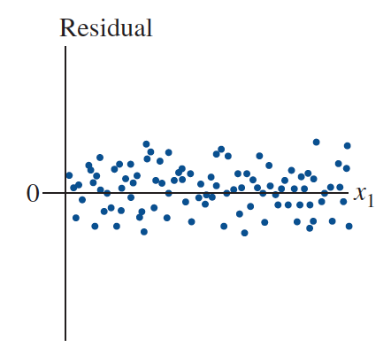

```{r, echo = FALSE, results = "hide"}
include_supplement("Screen__Shot__2021-03-18__at__17.00.02.png", recursive = TRUE)
```

Question
========
A *scatterplot* (scatterplot) with the residuals of a regression on the Y-axis and the independent variable on the X-axis can be used to check the assumption that....  
  


Answerlist
----------
* The standardized slope (Beta) and correlation coefficient (*r*) are always are the same size at any value of x (linearity).
* The relationship between the dependent and independent variable is causal (causality).
* The conditional standard deviation of y (s<sub>res</sub>) for each value of x is identical (constant variance).
* The explained variance (R<sup>2</sup>) and the marginal variance are always are identical to each other (homogeneity).

Solution
========

Answerlist
----------
* False
* False
* True
* False

Meta-information
================
exname: vufsw-residualplot-0077-en
extype: schoice
exsolution: 0010
exshuffle: TRUE
exsection: assumptions/homoscedasticity/residual plot
exextra[ID]: 615d4
exextra[Type]: conceptual
exextra[Program]: NA
exextra[Language]: English
exextra[Level]: statistical reasoning

