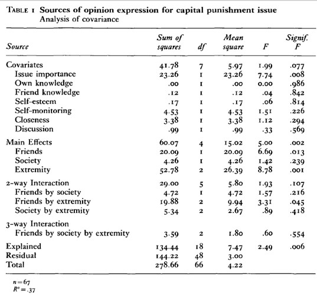

```{r, echo = FALSE, results = "hide"}
include_supplement("uu-ancova-218-nl-graph01.jpg", recursive = TRUE)
```
Question
========
Researcher Oshagan conducted a study on the influence of reference group on opinions about capital punishment. An ANCOVA was conducted with a number of covariates (see Table 1). The variables on which the hypotheses were formulated were: the variable Friends (many/few), Society (minority/majority) and Extremity (low/mid/high).  Table 1 shows Table 1 from the article: Oshagan, H. (1996), International Journal of Public Opinion, 8, 335-354.

Table 1 from Oshagan's article.



Which conclusion is correct based on the data in (above) Table 1?

Answerlist
----------
* Only the covariates Own Knowledge and Friend knowledge are relevant to control for in the prediction of Opinion Expression.
* The effect of Society on Opinion Expression is different for people who score low, medium or high on Extremity.
* The percentage of variance explained by the model is 14%.
* There is no significant main effect of Society, nor is there significant moderation involving the variable Society.


Solution
========
There is no significant main effect of society (p = .239). For moderation involving society look at the 2- and 3-way interactions. The Friends×Society interaction is not significant (p = .216), the Society×Extremity interaction is not significant (p = .418) nor is the Friends×Society×Extremity interaction significant (p = .554). Thus, there is also no significant moderation involving the Society variable.

Meta-information
================
exname: uu-ancova-218-en
extype: schoice
exsolution: 0001
exsection: Inferential Statistics/Parametric Techniques/ANOVA/ANCOVA
exextra[Type]: Interpreting output
exextra[Program]: 
exextra[Language]: English
exextra[Level]: Statistical Reasoning
