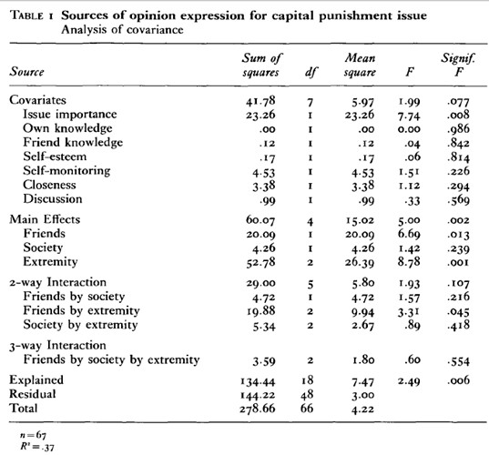

```{r, echo = FALSE, results = "hide"}
include_supplement("uu-ancova-218-nl-graph01.jpg", recursive = TRUE)
```
Question
========
De onderzoeker Oshagan heeft een onderzoek gedaan naar de invloed van referentiegroep op de mening over de doodstraf (capital punishment). Er is een ANCOVA uitgevoerd met een aantal covariaten (zie tabel 1). De variabelen waarover de hypotheses zijn geformuleerd zijn: de variabele Friends (veel/ weinig), Society 	(minority/majority) en Extremity (laag/midden/hoog). 
	
In tabel 1 vind je tabel 1 uit het artikel: Oshagan, H. (1996), International Journal of Public Opinion, 8, 335-354.

Tabel 1 uit het artikel van Oshagan.



Welke conclusie is correct op basis van de gegevens uit (bovenstaande) Tabel 1?

Answerlist
----------
* Alleen de covariaten Own Knowledge en Friend knowledge zijn relevant om op te controleren in de voorspelling van Opinion Expression.
* Het effect van Society op Opinion Expression is verschillend voor mensen die laag, midden of hoog scoren op Extremity.
* Het percentage verklaarde variantie door het model is 14%.
* Er is geen significant hoofdeffect van Society, noch is er sprake van significante moderatie waarbij de variabele Society betrokken is.


Solution
========
Er is geen significant hoofdeffect van society (p = .239). Voor moderatie waar society bij betrokken is kijk je naar de 2- en 3-wegsinteracties. De Friends×Society-interactie is niet significant (p = .216), de Society×Extremity-interactie is niet significant (p = .418) en ook de Friends×Society×Extremity-interactie is niet significant (p = .554). Er is dus ook geen spraken van significante moderatie waarbij de variabele Society betrokken is.


Meta-information
================
exname: uu-ancova-218-nl
extype: schoice
exsolution: 0001
exsection: Inferential Statistics/Parametric Techniques/ANOVA/ANCOVA
exextra[Type]: Interpreting output
exextra[Program]: 
exextra[Language]: Dutch
exextra[Level]: Statistical Reasoning
