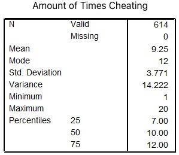
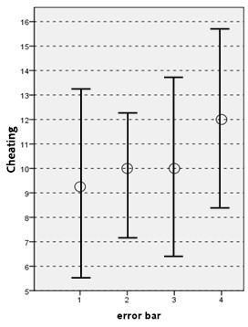

```{r, echo = FALSE, results = "hide"}
include_supplement("uu-Boxplot-801-en-tabel.jpg", recursive = TRUE)
```

```{r, echo = FALSE, results = "hide"}
include_supplement("uu-Boxplot-801-en-tabel2.jpg", recursive = TRUE)
```

Question
========
  
In the Netherlands last year, 614 students were caught cheating once or more during an examination. Below is SPSS output with some descriptive statistics of the distribution of the number of times cheating.




Which error bar in the figure below correctly represents the distribution of the number of times cheating?


  
Answerlist
----------
* Error bar 1
* Error bar 2
* Error bar 3
* Error bar 4	


Solution
========

Meta-information
================
exname: uu-Boxplot-801-en
extype: schoice
exsolution: 1000
exsection: Descriptive statistics/Data representation/Graphs/Boxplot
exextra[ID]: f97f8
exextra[Type]: Interpreting graph
exextra[Program]: SPSS
exextra[Language]: English
exextra[Level]: Statistical Literacy
