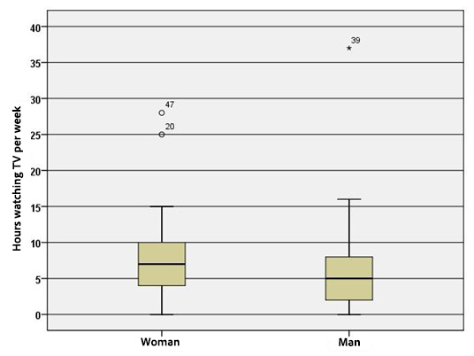

```{r, echo = FALSE, results = "hide"}
include_supplement("uu-Boxplot-802-en-tabel.jpg", recursive = TRUE)
```

Question
========
  
The boxplots below show the distribution of the number of hours per week men and women watch TV. The next two questions relate to these boxplots.




Evaluate the following statements.

	I. 	the average number of hours per week of TV viewing is equal to 7 for women and equal to 5 for men.
	II. the range (range) is smaller for men than for women.


  
Answerlist
----------
* Utterance I is correct, utterance II is incorrect.
* Utterance I is incorrect, utterance II is correct.
* Both statements are correct.
* Both statements are incorrect. 

Solution
========

Meta-information
================
exname: uu-Boxplot-802-en
extype: schoice
exsolution: 0001
exsection: Descriptive statistics/Data representation/Graphs/Boxplot
exextra[ID]: 74a30
exextra[Type]: Interpreting graph
exextra[Program]: SPSS
exextra[Language]: English
exextra[Level]: Statistical Literacy
