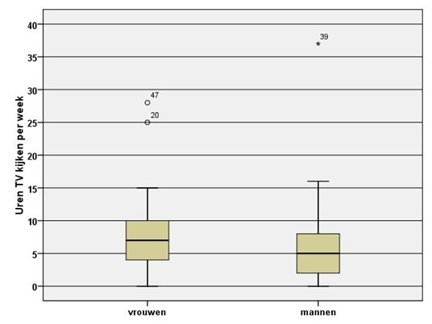

```{r, echo = FALSE, results = "hide"}
include_supplement("uu-Boxplot-802-nl-tabel.jpg", recursive = TRUE)
```


Question
========
  
In onderstaande boxplots is de verdeling weergegeven van het aantal uren per week dat mannen en vrouwen TV kijken. De volgende twee vragen hebben betrekking op deze boxplots.




Beoordeel de volgende uitspraken.

	I. 	het gemiddeld aantal uren per week TV kijken is voor de vrouwen gelijk aan 7 en voor de mannen gelijk aan 5.
	II. het bereik (range) is voor mannen kleiner dan voor vrouwen.


  
Answerlist
----------
* Uitspraak I is juist, uitspraak II is onjuist. 
* Uitspraak I is onjuist, uitspraak II is juist. 
* Beide uitspraken zijn juist. 
* Beide uitspraken zijn onjuist. 


Solution
========


Meta-information
================
exname: uu-Boxplot-802-nl.Rmd
extype: schoice
exsolution: 0001
exsection: Descriptive statistics/Data representation/Graphs/Boxplot
exextra[ID]: c2554
exextra[Type]: Interpreting graph
exextra[Program]: SPSS
exextra[Language]: Dutch
exextra[Level]: Statistical Literacy
