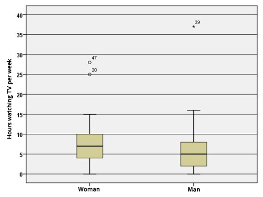

```{r, echo = FALSE, results = "hide"}
include_supplement("uu-Boxplot-803-en-tabel.jpg", recursive = TRUE)
```

Question
========
  
The boxplots below show the distribution of the number of hours per week men and women watch TV. The next two questions relate to these boxplots.




From both distributions in the boxplots above, the scores are converted to z-scores. Choose the statement that applies to the distributions of the z-scores.


  
Answerlist
----------
* The distributions of men and women will become more like the normal distribution.
* The outliers (outliers) in both men and women will disappear.
* The mean of women will become equal to the mean of men.
* All three statements a, b and c are incorrect.

Solution
========

Meta-information
================
exname: uu-Boxplot-803-en
extype: schoice
exsolution: 0010
exsection: Descriptive statistics/Data representation/Graphs/Boxplot
exextra[ID]: ad1b5
exextra[Type]: Interpreting graph
exextra[Program]: SPSS
exextra[Language]: English
exextra[Level]: Statistical Literacy
