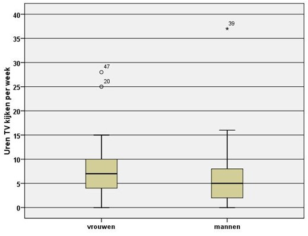

```{r, echo = FALSE, results = "hide"}
include_supplement("uu-Boxplot-803-nl-tabel.jpg", recursive = TRUE)
```


Question
========
  
In onderstaande boxplots is de verdeling weergegeven van het aantal uren per week dat mannen en vrouwen TV kijken. De volgende twee vragen hebben betrekking op deze boxplots.




Van beide verdelingen in bovenstaande boxplots worden de scores omgezet naar z-scores. Kies de uitspraak die geldt voor de verdelingen van de z-scores.


  
Answerlist
----------
* De verdelingen van mannen en vrouwen zullen meer de vorm van de normale verdeling gaan aannemen.
* De uitbijters (outliers) bij zowel de mannen als de vrouwen zullen verdwijnen.
* Het gemiddelde van de vrouwen wordt gelijk aan het gemiddelde van de mannen. 
* De uitspraken a, b en c zijn alledrie incorrect.


Solution
========


Meta-information
================
exname: uu-Boxplot-803-nl.Rmd
extype: schoice
exsolution: 0010
exsection: Descriptive statistics/Data representation/Graphs/Boxplot
exextra[Type]: Interpreting graph
exextra[Program]: SPSS
exextra[Language]: Dutch
exextra[Level]: Statistical Literacy
