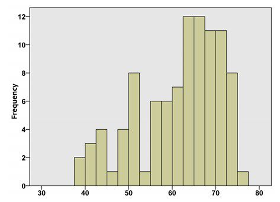
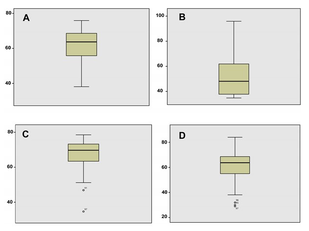

```{r, echo = FALSE, results = "hide"}
include_supplement("uu-Boxplot-804-en-tabel.jpg", recursive = TRUE)
```

```{r, echo = FALSE, results = "hide"}
include_supplement("uu-Boxplot-804-nl-tabel2.jpg", recursive = TRUE)
```

Question
========
  
Below is a histogram of the variable life expectancy based on data from 97 countries. Which boxplot correctly represents this distribution?





  
Answerlist
----------
* Boxplot A.
* Boxplot B.
* Boxplot C.
* Boxplot D.

Solution
========

Meta-information
================
exname: uu-Boxplot-804-en
extype: schoice
exsolution: 1000
exsection: Descriptive statistics/Data representation/Graphs/Boxplot
exextra[Type]: Interpreting graph
exextra[Program]: SPSS
exextra[Language]: English
exextra[Level]: Statistical Literacy
