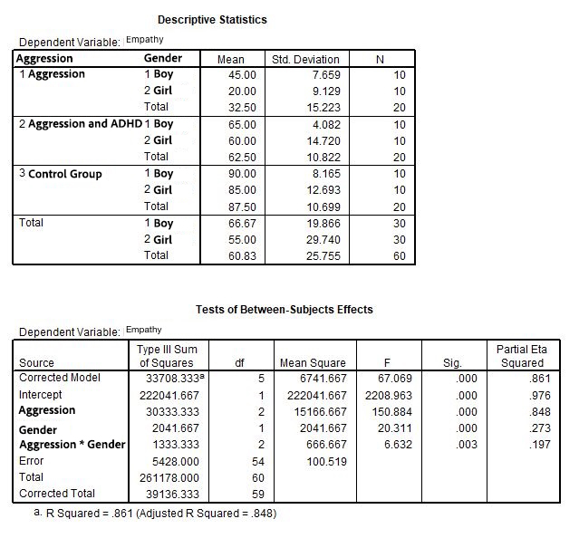

```{r, echo = FALSE, results = "hide"}
include_supplement("uu-Histogram-001-en-tabel.jpg", recursive = TRUE)
```

Question
========
A study by Wiede et al. (2005) looked at the amount of empathy (empathy) of aggressive children between the ages of 8 and 12, also looking at the difference between boys and girls. Here a distinction is made between aggressive children, aggressive children also diagnosed with ADHD, and children without behavioral problems (control group). Empathy is measured by showing a video of a boy falling off his bicycle, followed by a questionnaire that can be scored on a scale from 0 to 100.

The output below belongs to this study.



How can the condition of normal distribution be checked?

Answerlist
----------
* By performing Levene's Test.
* By making a histogram
* By creating an averaging diagram (Profile Plot)
* By performing a One-way ANOVA


Solution
========


Answerlist
----------
* This answer is incorrect.
* This answer is correct.
* This answer is incorrect.
* This answer is incorrect.

Meta-information
================
exname: uu-Histogram-001-en
extype: schoice
exsolution: 0100
exsection: Descriptive statistics/Data representation/Graphs/Histogram
exextra[Type]: Interpreting output, Case
exextra[Program]: SPSS
exextra[Language]: English
exextra[Level]: Statistical Literacy
