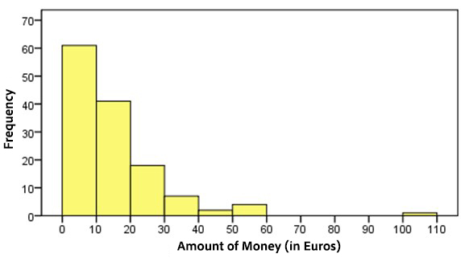

```{r, echo = FALSE, results = "hide"}
include_supplement("uu-Histogram-006-en-tabel.jpg", recursive = TRUE)
```

Question
========
In the first lecture of a statistics course with 134 students, the instructor asks how much money each student is carrying. A histogram of the data collected is below.


  
Which of the following descriptions is TRUE about the shape of the histogram?

Answerlist
----------
* Left skewed with an outlier
* Symmetrical with an outlier
* Right skew with an outlier
* Bimodal


Solution
========


Answerlist
----------
* This answer is incorrect: Left skewed is when the tail is on the left side.
* This answer is incorrect: Symmetrical means that left and right look the same.
* This answer is correct.
* This answer is incorrect: bimodal means there are two tops in the distribution.

Meta-information
================
exname: uu-Histogram-006-en
extype: schoice
exsolution: 0010
exsection: Descriptive statistics/Data representation/Graphs/Histogram
exextra[ID]: fbc42
exextra[Type]: Interpreting graph
exextra[Program]: SPSS
exextra[Language]: English
exextra[Level]: Statistical Literacy
