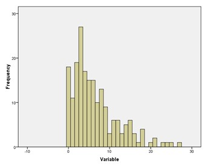

```{r, echo = FALSE, results = "hide"}
include_supplement("uu-Histogram-800-en-tabel.jpg", recursive = TRUE)
```

Question
========
  
Na de betrouwbaarheidsanalyse werd de somscore voor depressie berekend. De verdeling van de somscores wordt weergegeven in het histogram. De verdeling is ...


  
Antwoordlijst
----------
* Symmetrisch.
* Positief scheef.
* Negatief scheef.
* Bimodaal.


Solution
========

Meta-information
================
exname: uu-Histogram-800-nl
extype: schoice
exsolution: 0100
exsection: Descriptive statistics/Data representation/Graphs/Histogram
exextra[Type]: Interpreting graph
exextra[Program]: SPSS
exextra[Language]: Dutch
exextra[Level]: Statistical Literacy
