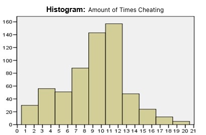

```{r, echo = FALSE, results = "hide"}
include_supplement("uu-Histogram-801-en-tabel.jpg", recursive = TRUE)
```

Question
========
  
The histogram below shows the frequency distribution of the number of times each student was caught. For clarity of the histogram, the data are grouped together. Which of the statements below regarding the histogram below are correct?

	I. The median of the ungrouped distribution is equal to 11.5. II. At least 1 student was caught cheating 2 times. 



  
Answerlist
----------
* Utterance I is correct, utterance II is incorrect.
* Utterance I is incorrect, utterance II is correct.
* Both statements are correct.
* Both statements are incorrect. 


Solution
========

Meta-information
================
exname: uu-Histogram-801-en
extype: schoice
exsolution: 0001
exsection: Descriptive statistics/Data representation/Graphs/Histogram
exextra[ID]: 5de55
exextra[Type]: Interpreting graph
exextra[Program]: SPSS
exextra[Language]: English
exextra[Level]: Statistical Literacy
