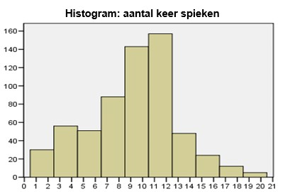

```{r, echo = FALSE, results = "hide"}
include_supplement("uu-Histogram-801-nl-tabel.jpg", recursive = TRUE)
```


Question
========
  
Het onderstaande histogram geeft de frequentieverdeling weer van het aantal keer dat elke student is betrapt. Voor de overzichtelijkheid van het histogram zijn de data gegroepeerd. Welke van de onderstaande uitspraken m.b.t. het onderstaande histogram zijn juist?

	I.	De mediaan van de ongegroepeerde verdeling is gelijk aan 11.5. 
	II.	Er is minimaal 1 student 2 keer betrapt op spieken. 



  
Answerlist
----------
* Uitspraak I is juist, uitspraak II is onjuist. 
* Uitspraak I is onjuist, uitspraak II is juist. 
* Beide uitspraken zijn juist. 
* Beide uitspraken zijn onjuist. 


Solution
========
  


Answerlist
----------


Meta-information
================
exname: uu-Histogram-801-nl.Rmd
extype: schoice
exsolution: 0001
exsection: Descriptive statistics/Data representation/Graphs/Histogram
exextra[Type]: Interpretating graph
exextra[Program]: SPSS
exextra[Language]: Dutch
exextra[Level]: Statistical Literacy
