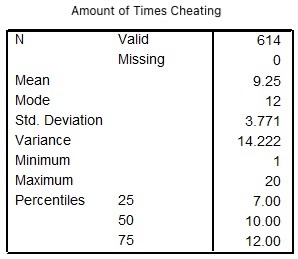

```{r, echo = FALSE, results = "hide"}
include_supplement("uu-Interquartile-Range-800-en-tabel.jpg", recursive = TRUE)
```

Question
========
  
In the Netherlands last year, 614 students were caught cheating once or more during an examination. Below is SPSS output with some descriptive statistics of the distribution of the number of times cheating.

The following four questions relate to this output.




What is the semi-interquartile range (semi-IQR) of the distribution of the number of times cheating? 
Answerlist
----------
* 6
* 5
* 2.5
* 1.88

Solution
========

Meta-information
================
exname: uu-Interquartile-Range-800-en
extype: schoice
exsolution: 0010
exsection: Descriptive statistics/Summary Statistics/Measures of Spread/Interquartile Range
exextra[Type]: Interpreting output
exextra[Program]: SPSS
exextra[Language]: English
exextra[Level]: Statistical Literacy
