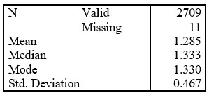

```{r, echo = FALSE, results = "hide"}
include_supplement("uu-Measures-of-Location-800-en-tabel.jpg", recursive = TRUE)
```

Question
========
  
Een gemiddelde over alle 12 vragen werd dan verkregen om gebruikt te worden als autonomiescore. SPSS werd gebruikt om de volgende beschrijvende statistieken te verkrijgen: 



Wat kun je zeggen over de vorm van de verdeling van autonomiescores? 
Answerlist
----------
* Waarschijnlijk een symmetrische verdeling.
* Waarschijnlijk een zeer negatief scheve verdeling.
* Waarschijnlijk een zeer positief scheve verdeling.
* Waarschijnlijk een bimodale verdeling.


Solution
========

Meta-information
================
exname: uu-Measures-of-Location-800-nl
extype: schoice
exsolution: 1000
exsection: Descriptive statistics/Summary Statistics/Measures of Location
exextra[Type]: Interpreting graph
exextra[Program]: SPSS
exextra[Language]: Dutch
exextra[Level]: Statistical Literacy
