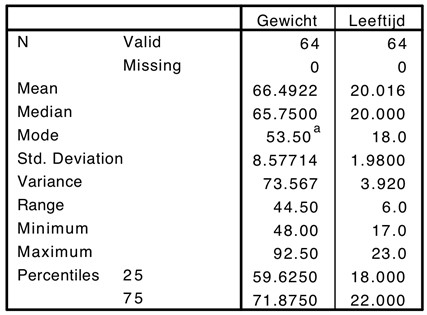

```{r, echo = FALSE, results = "hide"}
include_supplement("uu-Summary-Statistics-801-nl-tabel.jpg", recursive = TRUE)
```


Question
========

Van 64 studentes is het gewicht en de leeftijd verzameld. De onderstaande SPSS-output geeft informatie over beide variabelen. De volgende vraag heeft betrekking op deze output.



Welke van onderstaande uitspraken is waar?

Answerlist
----------
*	De verdeling van de scores op leeftijd heeft een kleinere spreiding dan de verdeling van de scores op gewicht.
*	Ongeveer 68% van de studentes hebben een leeftijd van 20 jaar plus of min 1.98 jaar.
*	Het verwijderen van de maximumscore van de variabele gewicht zal de spreiding doen afnemen.
*	Alle bovenstaande uitspraken zijn waar.


Solution
========


Meta-information
================
exname: uu-Summary Statistics-801-nl.Rmd
extype: schoice
exsolution: 0001
exsection: Descriptive statistics/Summary Statistics
exextra[Type]: Interpretating output
exextra[Program]: SPSS
exextra[Language]: Dutch
exextra[Level]: Statistical Literacy
