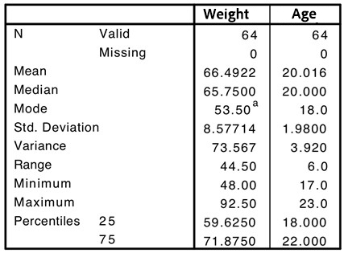

```{r, echo = FALSE, results = "hide"}
include_supplement("uu-Summary-Statistics-801-en-tabel.jpg", recursive = TRUE)
```

Question
========

Weight and age were collected from 64 female students. The SPSS output below provides information on both variables. The following question relates to this output.



Which of the following statements is TRUE?

Answerlist
----------
* The distribution of scores by age has a smaller distribution than the distribution of scores by weight.
* About 68% of college students have an age of 20 years plus or minus 1.98 years.
* Removing the maximum score of the variable weight will decrease the dispersion.
* All of the above statements are TRUE.

Solution
========

Meta-information
================
exname: uu-Summary Statistics-801-en
extype: schoice
exsolution: 0001
exsection: Descriptive statistics/Summary Statistics
exextra[Type]: Interpretating output
exextra[Program]: SPSS
exextra[Language]: English
exextra[Level]: Statistical Literacy
