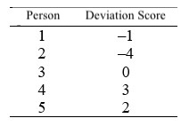

```{r, echo = FALSE, results = "hide"}
include_supplement("uu-variance-600-en-tabel.jpg", recursive = TRUE)
```

Question
========
  
In a population of 5 individuals with an extremely rare disease, the age at which the disease first manifested itself was measured. The table below shows the deviation scores for age for these 5 individuals. What is the variance of the distribution of age in this population?


  
Answerlist
----------
* It cannot be determined without giving the mean µ of the distribution.
* 2
* 5.5
* 6 


Solution
========
  


Answerlist
----------
* You can: the deviation scores are in the table.
* No, that's not correct unfortunately.
* No, that's not right unfortunately.
* The correct answer is 6.

Meta-information
================
exname: uu-variance-600-en
extype: schoice
exsolution: 0001
exsection: Descriptive statistics/Summary Statistics/Measures of Spread/Variance
exextra[ID]: 4c58b
exextra[Type]: Interpretating output
exextra[Program]: SPSS
exextra[Language]: English
exextra[Level]: Statistical Literacy
