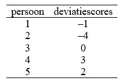

```{r, echo = FALSE, results = "hide"}
include_supplement("uu-variance-600-nl-tabel.jpg", recursive = TRUE)
```


Question
========
  
In een populatie van 5 personen met een uiterst zeldzame ziekte is de leeftijd gemeten waarop de ziekte zich voor het eerst heeft geopenbaard. In de onderstaande tabel zijn voor deze 5 personen de deviatiescores voor leeftijd weergegeven. Wat is de variantie van de verdeling van leeftijd in deze populatie?


  
Answerlist
----------
*	Deze kan niet worden bepaald zonder dat het gemiddelde µ van de verdeling is gegeven. 
*	2 
*	5.5
*	6 


Solution
========
  


Answerlist
----------
* Dat kan wel: de deviatiescores staan in de tabel.
* Nee, dat klopt niet helaas.
* Nee, dat klopt niet helaas.
* Het juiste antwoord is 6. 


Meta-information
================
exname: uu-variance-600-nl.Rmd
extype: schoice
exsolution: 0001
exsection: Descriptive statistics/Summary Statistics/Measures of Spread/Variance
exextra[ID]: f0ed5
exextra[Type]: Interpretating output
exextra[Program]: SPSS
exextra[Language]: Dutch
exextra[Level]: Statistical Literacy
