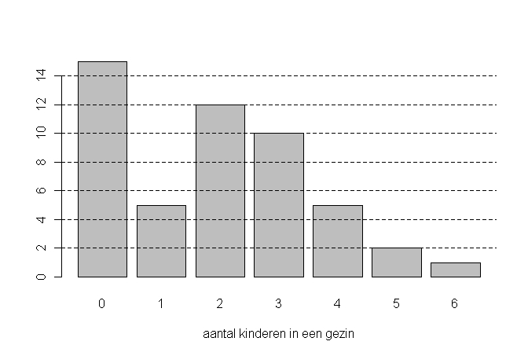

```{r, echo = FALSE, results = "hide"}
include_supplement("uva-bar-graph-1200-nl-graph01.png", recursive = TRUE)
```

Question
========

Below is a bar graph of the number of children in a sample of 50 families.‖ The average number of children per family in this sample is equal to:



Answerlist
----------

* 1,6
* 1,9
* 2
* 2,7

Solution
========

Answerlist
----------

* 1,6: Incorrect
* 1,9: Correct
* 2: Incorrect
* 2,7: Incorrect

Meta-information
================
exname: uva-bar-graph-1200-en
extype: schoice
exsolution: 0100
exsection: Descriptive statistics/Data representation/Graphs/Bar graph
exextra[Type]: Conceptual
exextra[Language]: English
exextra[Level]: Statistical Literacy
exextra[IRT-Difficulty]: 2.652
exextra[p-value]: 0.443
