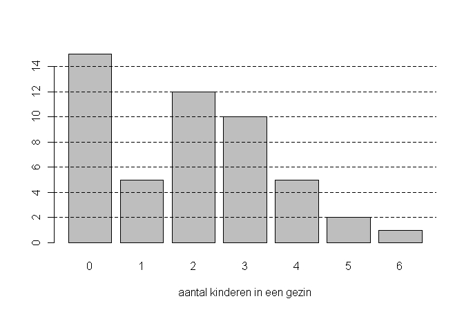

```{r, echo = FALSE, results = "hide"}
include_supplement("uva-bar-graph-1200-nl-graph01.png", recursive = TRUE)
```

Question
========

Hieronder staat een staafdiagram van het aantal kinderen in een
steekproef van 50 gezinnen.\
Het gemiddelde aantal kinderen per gezin in deze steekproef is gelijk
aan:



Answerlist
----------

* 1,6
* 1,9
* 2
* 2,7

Solution
========

Het correcte antwoord is: 

* 1,9

Meta-information
================
exname: uva-bar-graph-1200-nl
extype: schoice
exsolution: 0100
exsection: Descriptive statistics/Data representation/Graphs/Bar graph
exextra[Type]: Conceptual
exextra[Language]: Dutch
exextra[Level]: Statistical Literacy
exextra[IRT-Difficulty]: 2.652
exextra[p-value]: 0.443
