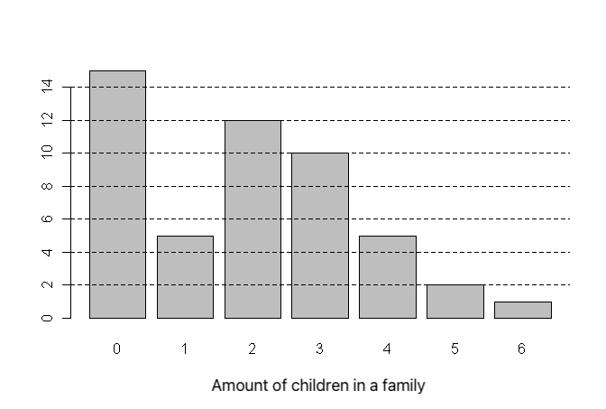

```{r, echo = FALSE, results = "hide"}
include_supplement("uva-bar-graph-1201-en-graph01.png", recursive = TRUE)
```

Question
========

Below is a bar graph of the number of children in a sample of 50 families.‖ The median number of children per family in this sample is equal to:



Answerlist
----------

* 1,5
* 1,9
* 2
* 3

Solution
========

Answerlist
----------

* 1.5: Incorrect
* 1.9: Incorrect
* 2: Correct
* 3: Incorrect

Meta-information
================
exname: uva-bar-graph-1201-en
extype: schoice
exsolution: 0010
exsection: Descriptive statistics/Data representation/Graphs/Bar graph
exextra[Type]: Conceptual
exextra[Language]: English
exextra[Level]: Statistical Literacy
exextra[IRT-Difficulty]: 2.911
exextra[p-value]: 0.4126
