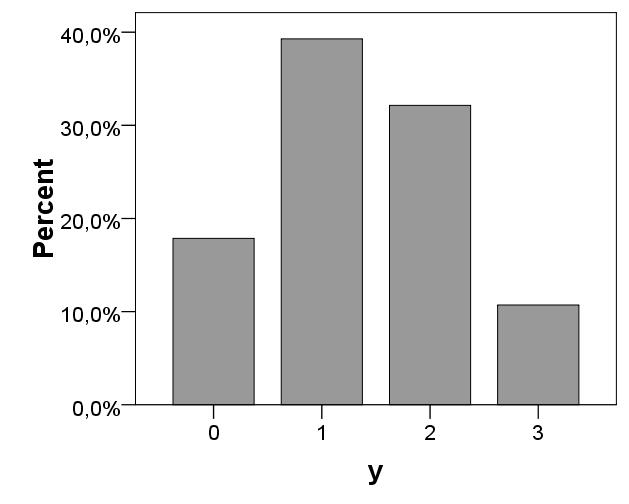

```{r, echo = FALSE, results = "hide"}
include_supplement("uva-bar-graph-1205-nl-graph01.png", recursive = TRUE)
```

Question
========

In 28 families, the number of children in the family was determined. The bar graph below shows the relative frequencies of the variable y (number of children in a family).______________________________. How many families with more than 1 child are there?



Answerlist
----------

* 5
* 11
* 23
* 82

Solution
========

Answerlist
----------

* 5: Incorrect
* 11: Correct
* 23: Incorrect
* 82: Incorrect

Meta-information
================
exname: uva-bar-graph-1205-en
extype: schoice
exsolution: 0100
exsection: Descriptive statistics/Data representation/Graphs/Bar graph
exextra[Type]: Calculation
exextra[Language]: English
exextra[Level]: Statistical Literacy
exextra[IRT-Difficulty]: 0.618
exextra[p-value]: 0.9015
