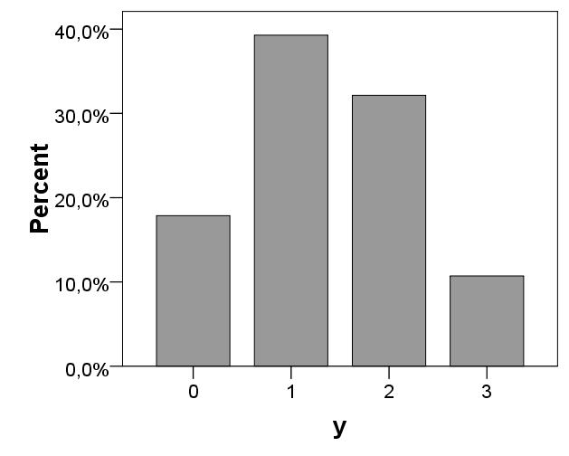

```{r, echo = FALSE, results = "hide"}
include_supplement("uva-bar-graph-1205-nl-graph01.png", recursive = TRUE)
```

Question
========

Bij 28 gezinnen is bepaald hoeveel kinderen het gezin telt.\
In onderstaand staafdiagram staan de relatieve frequenties van de
variabele y (aantal kinderen in een gezin).\
Hoeveel gezinnen met meer dan 1 kind zijn er?



Answerlist
----------

* 5
* 11
* 23
* 82

Solution
========

Answerlist
----------

* 5: Incorrect
* 11: Correct
* 23: Incorrect
* 82: Incorrect

Meta-information
================
exname: uva-bar-graph-1205-nl
extype: schoice
exsolution: 0100
exsection: Descriptive statistics/Data representation/Graphs/Bar graph
exextra[ID]: 23214
exextra[Type]: Calculation
exextra[Language]: Dutch
exextra[Level]: Statistical Literacy
exextra[IRT-Difficulty]: 0.618
exextra[p-value]: 0.9015
