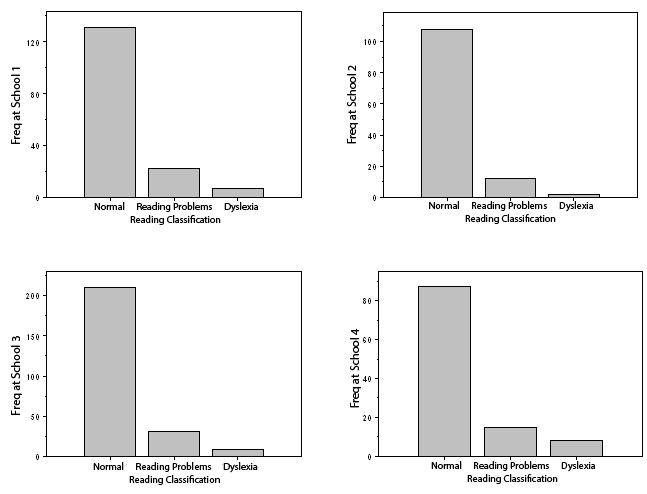

```{r, echo = FALSE, results = "hide"}
include_supplement("uva-bar-graph-295-en-graph01.png", recursive = TRUE)
```

Question
========

In four schools, students in grades 3, 4 and 5 are assigned to one of 3 classes in terms of their reading abilities: normal, reading difficulties, dyslexia. The numbers of students in each class are shown in the following 4 bar graphs. The largest number of students without reading difficulties or dyslexia (in absolute frequency) occurs at school



Answerlist
----------

* 1
* 2
* 3
* 4

Solution
========

Answerlist
----------

* 1: Incorrect
* 2: Incorrect
* 3: Correct
* 4: Incorrect

Meta-information
================
exname: uva-bar-graph-295-en
extype: schoice
exsolution: 0010
exsection: Descriptive statistics/Data representation/Graphs/Bar graph
exextra[ID]: 33217
exextra[Type]: Calculation
exextra[Language]: English
exextra[Level]: Statistical Literacy
exextra[IRT-Difficulty]: 4.125
exextra[p-value]: 0.0954
