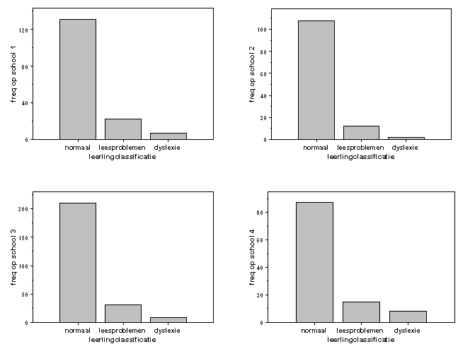

```{r, echo = FALSE, results = "hide"}
include_supplement("uva-bar-graph-295-nl-graph01.png", recursive = TRUE)
```

Question
========

Op vier scholen worden de leerlingen in groepen 3, 4 en 5 in één van 3
klassen ingedeeld voor wat betreft hun leesvaardigheid: normaal,
leesproblemen, dyslexie. De aantallen leerlingen in iedere klasse staan
in de volgende 4 staafdiagrammen weergegeven. Het grootst aantal
leerlingen zonder leesproblemen of dyslexie (in absolute frequentie)
komt voor op school



Answerlist
----------

* 1
* 2
* 3
* 4

Solution
========

Answerlist
----------

* 1: Incorrect
* 2: Incorrect
* 3: Correct
* 4: Incorrect

Meta-information
================
exname: uva-bar-graph-295-nl
extype: schoice
exsolution: 0010
exsection: Descriptive statistics/Data representation/Graphs/Bar graph
exextra[ID]: cec4f
exextra[Type]: Calculation
exextra[Language]: Dutch
exextra[Level]: Statistical Literacy
exextra[IRT-Difficulty]: 4.125
exextra[p-value]: 0.0954
