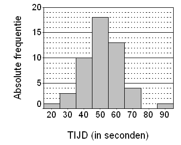

```{r, echo = FALSE, results = "hide"}
include_supplement("uva-bar-graph-319-nl-graph01.png", recursive = TRUE)
```

Question
========

In een beschrijvend onderzoek is bij 50 patiënten met
ademhalingsmoeilijkheden gekeken naar het aantal seconden dat zij de
adem in kunnen houden. De resultaten staan in het onderstaande histogram
weergegeven. Het percentage mensen dat de adem meer dan 55 seconden kan
inhouden is in deze steekproef gelijk aan



Answerlist
----------

* 10%
* 18%
* 26%
* 36%

Solution
========

Het correcte antwoord is: 

* 36%

Meta-information
================
exname: uva-bar-graph-319-nl
extype: schoice
exsolution: 0001
exsection: Descriptive statistics/Data representation/Graphs/Bar graph
exextra[Type]: Conceptual
exextra[Language]: Dutch
exextra[Level]: Statistical Literacy
exextra[IRT-Difficulty]: 3.558
exextra[p-value]: 0.1929
