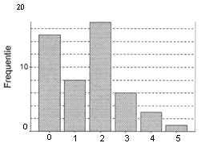

```{r, echo = FALSE, results = "hide"}
include_supplement("uva-bar-graph-343-nl-graph01.png", recursive = TRUE)
```

Question
========

The chart below shows of 50 families how many children they contain. The percentage of families with 3 or more children is equal to



Answerlist
----------

* 8
* 10
* 12
* 20

Solution
========

Answerlist
----------

* 8: Incorrect
* 10: Incorrect
* 12: Incorrect
* 20: Correct

Meta-information
================
exname: uva-bar-graph-343-en
extype: schoice
exsolution: 0001
exsection: Descriptive statistics/Data representation/Graphs/Bar graph
exextra[Type]: Calculation
exextra[Language]: English
exextra[Level]: Statistical Literacy
exextra[IRT-Difficulty]: 4.311
exextra[p-value]: 0.0681
