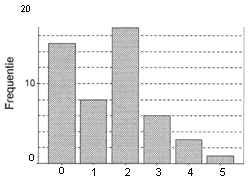

```{r, echo = FALSE, results = "hide"}
include_supplement("uva-bar-graph-343-nl-graph01.png", recursive = TRUE)
```

Question
========

In onderstaande grafiek staat van 50 gezinnen hoeveel kinderen ze
bevatten. Het percentage gezinnen met 3 of meer kinderen is gelijk aan



Answerlist
----------

* 8
* 10
* 12
* 20

Solution
========

Answerlist
----------

* 8: Incorrect
* 10: Incorrect
* 12: Incorrect
* 20: Correct

Meta-information
================
exname: uva-bar-graph-343-nl
extype: schoice
exsolution: 0001
exsection: Descriptive statistics/Data representation/Graphs/Bar graph
exextra[ID]: c2b2a
exextra[Type]: Calculation
exextra[Language]: Dutch
exextra[Level]: Statistical Literacy
exextra[IRT-Difficulty]: 4.311
exextra[p-value]: 0.0681
