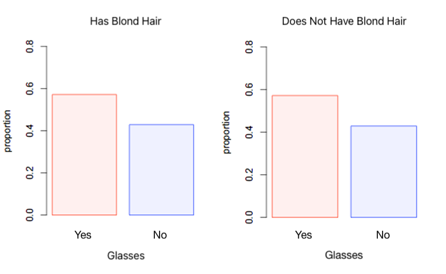

```{r, echo = FALSE, results = "hide"}
include_supplement("uva-bar-graph-8-en-graph01.png", recursive = TRUE)
```

Question
========

Check out the *bar charts* below. The *bar charts* show the conditional proportions of the variables blonde (yes or no) and glasses wear (yes or no). Evaluate whether it is likely that there is an association between these variables.



Answerlist
----------

* It is likely that there is an association because the conditional proportions of 'blonde' are different for 'wearing glasses' than for 'not wearing glasses'.
* There is no reason to think there is an association because the conditional proportions of 'blonde' are the same for 'wearing glasses' as for 'not wearing glasses'.
* Whether there might be an association between 'blonde' and 'wearing glasses' cannot be inferred from these conditional proportions.

Solution
========

Answerlist
----------

* It is likely that there is an association because the conditional proportions of "blonde" are different for "wearing glasses" than for "not wearing glasses. Incorrect
* There is no reason to think there is an association because the conditional proportions of 'blonde' are the same for 'wearing glasses' as for 'not wearing glasses'...: Correct
* Whether there might be an association between 'blonde' and 'wearing glasses' cannot be read from these conditional proportions...: Incorrect

Meta-information
================
exname: uva-bar-graph-8-en
extype: schoice
exsolution: 010
exsection: Descriptive statistics/Data representation/Graphs/Bar graph
exextra[Type]: Conceptual
exextra[Language]: English
exextra[Level]: Statistical Literacy
exextra[IRT-Difficulty]: -3.444
exextra[p-value]: 0.9814
