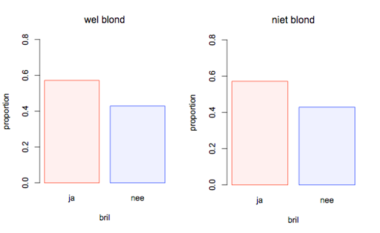

```{r, echo = FALSE, results = "hide"}
include_supplement("uva-bar-graph-8-nl-graph01.png", recursive = TRUE)
```

Question
========

Bekijk onderstaande *bar charts*. In de *bar charts* worden de
conditionele proporties weergegeven van de variabelen \'blond\' (ja of
nee) en \'bril dragen\' (ja of nee). Beoordeel of het waarschijnlijk is
dat er een associatie is tussen deze variabelen.



Answerlist
----------

* Het is waarschijnlijk dat er een associatie is want de conditionele proporties van 'blond' zijn anders voor 'bril dragen' dan voor 'geen bril dragen'.
* Er is geen aanleiding om te denken dat er een associatie is want de conditionele proporties van 'blond' zijn het zelfde voor 'bril dragen' als voor 'geen bril dragen'.
* Of er mogelijk een associatie is tussen 'blond' en 'bril dragen' is niet af te lezen uit deze conditionele proporties.

Solution
========

Answerlist
----------

* Het is waarschijnlijk dat er een associatie is want de conditionele proporties van 'blond' zijn anders voor 'bril dragen' dan voor 'geen bril dragen'.: Incorrect
* Er is geen aanleiding om te denken dat er een associatie is want de conditionele proporties van 'blond' zijn het zelfde voor 'bril dragen' als voor 'geen bril dragen'.: Correct
* Of er mogelijk een associatie is tussen 'blond' en 'bril dragen' is niet af te lezen uit deze conditionele proporties.: Incorrect

Meta-information
================
exname: uva-bar-graph-8-nl
extype: schoice
exsolution: 010
exsection: Descriptive statistics/Data representation/Graphs/Bar graph
exextra[Type]: Conceptual
exextra[Language]: Dutch
exextra[Level]: Statistical Literacy
exextra[IRT-Difficulty]: -3.444
exextra[p-value]: 0.9814
