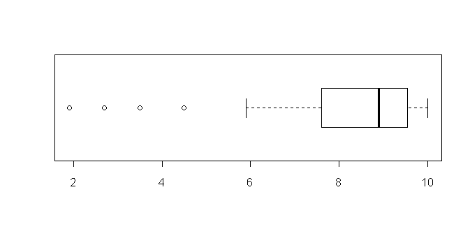

```{r, echo = FALSE, results = "hide"}
include_supplement("uva-boxplot-1204-nl-graph01.png", recursive = TRUE)
```

Question
========

Below is a boxplot of a sample of 60 observations._____________________. The standard deviation of this sample is approximately equal to:



Answerlist
----------

* 0,3
* 1,8
* 4,0
* 8,9

Solution
========

Answerlist
----------

* 0.3: Incorrect
* 1,8: Correct
* 4.0: Incorrect
* 8.9: Incorrect

Meta-information
================
exname: uva-boxplot-1204-en
extype: schoice
exsolution: 0100
exsection: Descriptive statistics/Data representation/Graphs/Boxplot
exextra[Type]: Conceptual
exextra[Language]: English
exextra[Level]: Statistical Literacy
exextra[IRT-Difficulty]: 0.622
exextra[p-value]: 0.901
