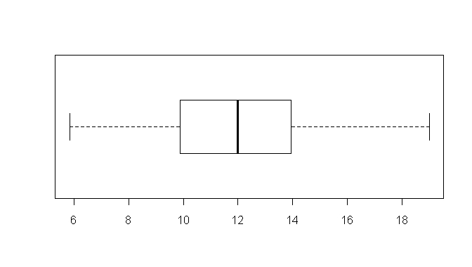

```{r, echo = FALSE, results = "hide"}
include_supplement("uva-boxplot-1206-nl-graph01.png", recursive = TRUE)
```

Question
========

Below is a boxplot of the data from a sample of 80 individuals from a normally distributed population. Estimate the sample standard deviation.Ê Hint: how many sd is the box wide?



Answerlist
----------

* Sd is about 1
* Sd is about 3
* Sd is about 6
* Sd is about 13

Solution
========

Answerlist
----------

* Sd is about 1: Incorrect
* Sd is about 3: Correct
* SD is about 6: Incorrect
* Sd is about 13: Incorrect

Meta-information
================
exname: uva-boxplot-1206-en
extype: schoice
exsolution: 0100
exsection: Descriptive statistics/Data representation/Graphs/Boxplot
exextra[ID]: a3510
exextra[Type]: Conceptual
exextra[Language]: English
exextra[Level]: Statistical Literacy
exextra[IRT-Difficulty]: 1.039
exextra[p-value]: 0.8891
