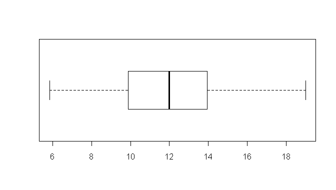

```{r, echo = FALSE, results = "hide"}
include_supplement("uva-boxplot-1206-nl-graph01.png", recursive = TRUE)
```

Question
========

Hieronder staat een boxplot van de gegevens uit een steekproef van 80
personen uit een normaal verdeelde populatie. Schat de
steekproefstandaarddeviatie.\
Hint: hoeveel sd\'s is de box breed?



Answerlist
----------

* sd is ongeveer 1
* sd is ongeveer 3
* sd is ongeveer 6
* sd is ongeveer 13

Solution
========

Answerlist
----------

* sd is ongeveer 1: Incorrect
* sd is ongeveer 3: Correct
* sd is ongeveer 6: Incorrect
* sd is ongeveer 13: Incorrect

Meta-information
================
exname: uva-boxplot-1206-nl
extype: schoice
exsolution: 0100
exsection: Descriptive statistics/Data representation/Graphs/Boxplot
exextra[ID]: 4abe7
exextra[Type]: Conceptual
exextra[Language]: Dutch
exextra[Level]: Statistical Literacy
exextra[IRT-Difficulty]: 1.039
exextra[p-value]: 0.8891
