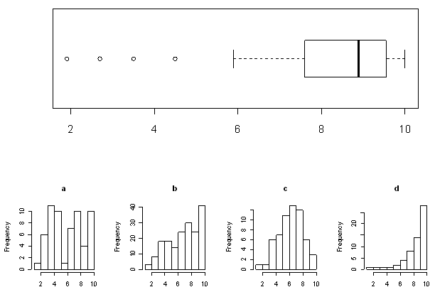

```{r, echo = FALSE, results = "hide"}
include_supplement("uva-boxplot-1209-nl-graph01.png", recursive = TRUE)
```

Question
========

Below is a boxplot of a sample of 60 observations.Ê Which of the following 4 histograms is from the same data set as the boxplot?



Answerlist
----------

* A
* B
* C
* D

Solution
========

Answerlist
----------

* A: Incorrect
* B:Incorrect
* C: Incorrect
* D: Correct

Meta-information
================
exname: uva-boxplot-1209-en
extype: schoice
exsolution: 0001
exsection: Descriptive statistics/Data representation/Graphs/Boxplot
exextra[Type]: Conceptual
exextra[Language]: English
exextra[Level]: Statistical Literacy
exextra[IRT-Difficulty]: 1.399
exextra[p-value]: 0.8685
