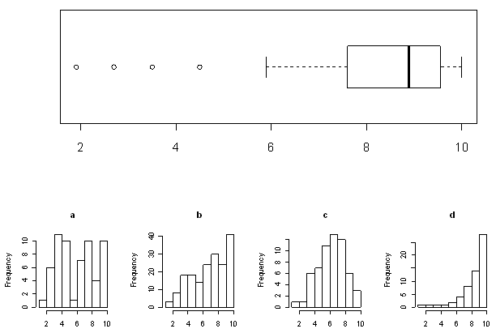

```{r, echo = FALSE, results = "hide"}
include_supplement("uva-boxplot-1209-nl-graph01.png", recursive = TRUE)
```

Question
========

Hieronder staat een boxplot van een steekproef van 60 waarnemingen.\
Welke van onderstaande 4 histogrammen is afkomstig van dezelfde dataset
als het boxplot?



Answerlist
----------

a
b
c
d

Solution
========

Answerlist
----------

a: Incorrect
b: Incorrect
c: Incorrect
d: Correct

Meta-information
================
exname: uva-boxplot-1209-nl
extype: schoice
exsolution: 0001
exsection: Descriptive statistics/Data representation/Graphs/Boxplot
exextra[Type]: Conceptual
exextra[Language]: Dutch
exextra[Level]: Statistical Literacy
exextra[IRT-Difficulty]: 1.399
exextra[p-value]: 0.8685
