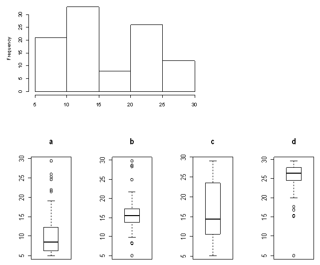

```{r, echo = FALSE, results = "hide"}
include_supplement("uva-boxplot-1212-nl-graph01.png", recursive = TRUE)
```

Question
========

Below are a histogram and 4 boxplots. Which of the 4 boxplots is from the same data set as the histogram?



Answerlist
----------

* A
* B
* C
* D

Solution
========

Answerlist
----------

* A: Incorrect
* B:Incorrect
* C: Correct
* D: Incorrect

Meta-information
================
exname: uva-boxplot-1212-en
extype: schoice
exsolution: 0010
exsection: Descriptive statistics/Data representation/Graphs/Boxplot
exextra[ID]: 1d2cc
exextra[Type]: Conceptual
exextra[Language]: English
exextra[Level]: Statistical Literacy
exextra[IRT-Difficulty]: 0.256
exextra[p-value]: 0.9175
