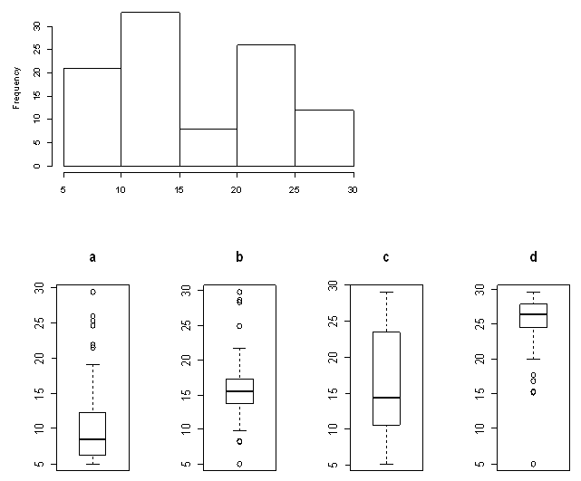

```{r, echo = FALSE, results = "hide"}
include_supplement("uva-boxplot-1212-nl-graph01.png", recursive = TRUE)
```

Question
========

Hieronder staan een histogram en 4 boxplots. Welke van de 4 boxplots is
afkomstig van dezelfde dataset als het histogram?



Answerlist
----------

* a
* b
* c
* d

Solution
========

Het correcte antwoord is: 

* c

Meta-information
================
exname: uva-boxplot-1212-nl
extype: schoice
exsolution: 0010
exsection: Descriptive statistics/Data representation/Graphs/Boxplot
exextra[Type]: Conceptual
exextra[Language]: Dutch
exextra[Level]: Statistical Literacy
exextra[IRT-Difficulty]: 0.256
exextra[p-value]: 0.9175
