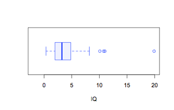

```{r, echo = FALSE, results = "hide"}
include_supplement("uva-boxplot-14-nl-graph01.png", recursive = TRUE)
```

Question
========

Bekijk onderstaande boxplot voor de variabele IQ. Wat is ongeveer het
derde kwartiel (Q3)?



Answerlist
----------

* 2
* 3
* 5

Solution
========

Het correcte antwoord is: 

* 5

Meta-information
================
exname: uva-boxplot-14-nl
extype: schoice
exsolution: 001
exsection: Descriptive statistics/Data representation/Graphs/Boxplot
exextra[Type]: Conceptual, Calculation
exextra[Language]: Dutch
exextra[Level]: Statistical Literacy
exextra[IRT-Difficulty]: -5.198
exextra[p-value]: 0.9948
