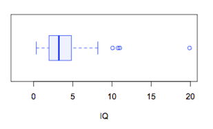

```{r, echo = FALSE, results = "hide"}
include_supplement("uva-boxplot-777-nl-graph01.png", recursive = TRUE)
```

Question
========

Consider the boxplot below for the variable IQ. Between which two values lies exactly 50% of the data?



Answerlist
----------

* Between 0 and 8.
* Between 2 and 5.
* Between 2 and 3.

Solution
========

Answerlist
----------

* Between 0 and 8..: Incorrect
* Between 2 and 5: Correct
* Between 2 and 3: Incorrect

Meta-information
================
exname: uva-boxplot-777-en
extype: schoice
exsolution: 010
exsection: Descriptive statistics/Data representation/Graphs/Boxplot
exextra[Type]: Conceptual
exextra[Language]: English
exextra[Level]: Statistical Literacy
exextra[IRT-Difficulty]: 4.428
exextra[p-value]: 0.0278
