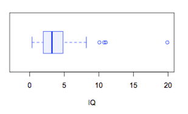

```{r, echo = FALSE, results = "hide"}
include_supplement("uva-boxplot-777-nl-graph01.png", recursive = TRUE)
```

Question
========

Bekijk onderstaande boxplot voor de variabele IQ. Tussen welke twee
waarden ligt precies 50% van de data?



Answerlist
----------

* Tussen 0 en 8.
* Tussen 2 en 5.
* Tussen 2 en 3.

Solution
========

Answerlist
----------

* Tussen 0 en 8.: Incorrect
* Tussen 2 en 5.: Correct
* Tussen 2 en 3.: Incorrect

Meta-information
================
exname: uva-boxplot-777-nl
extype: schoice
exsolution: 010
exsection: Descriptive statistics/Data representation/Graphs/Boxplot
exextra[ID]: e0bb1
exextra[Type]: Conceptual
exextra[Language]: Dutch
exextra[Level]: Statistical Literacy
exextra[IRT-Difficulty]: 4.428
exextra[p-value]: 0.0278
