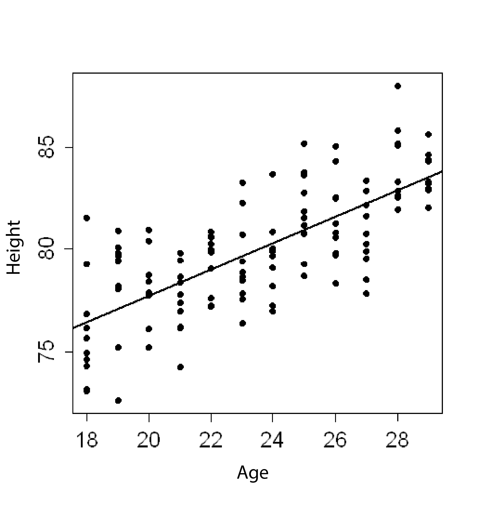

```{r, echo = FALSE, results = "hide"}
include_supplement("uva-correlation-1266-en-graph01.png", recursive = TRUE)
```

Question
========

Of a number of children, age was determined in months, and height in centimeters. The data are plotted in the attached scatterplot.™. The correlation coefficient between height and age is 0.74. The percentage of variation in height that is correlated in this sample with variation in age is:



Answerlist
----------

* 55%
* 74%
* 86%
* Not to be determined

Solution
========

Answerlist
----------

* 55%: Correct
* 74%: Incorrect
* 86%: Incorrect
* Undeterminable: Incorrect

Meta-information
================
exname: uva-correlation-1266-en
extype: schoice
exsolution: 1000
exsection: Descriptive statistics/Summary Statistics/Bivariate statistics/Correlation
exextra[Type]: Conceptual
exextra[Language]: English
exextra[Level]: Statistical Literacy
exextra[IRT-Difficulty]: 3.997
exextra[p-value]: 0.1222
