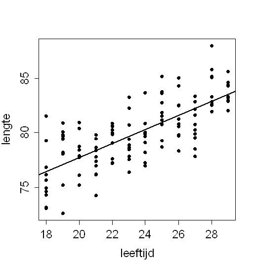

```{r, echo = FALSE, results = "hide"}
include_supplement("uva-correlation-1266-nl-graph01.png", recursive = TRUE)
```

Question
========

Van een aantal kinderen is de leeftijd in maanden bepaald, en de lengte
in centimeters. De gegevens zijn uitgezet in bijgaand
spreidingsdiagram.\
De correlatiecoëfficiënt tussen lengte en leeftijd is 0.74. Het
percentage van de variatie in lengte dat in deze steekproef samenhangt
met variatie in leeftijd is:



Answerlist
----------

* 55%
* 74%
* 86%
* niet te bepalen

Solution
========

Het correcte antwoord is: 

* 55%

Meta-information
================
exname: uva-correlation-1266-nl
extype: schoice
exsolution: 1000
exsection: Descriptive statistics/Summary Statistics/Bivariate statistics/Correlation
exextra[Type]: Conceptual
exextra[Language]: Dutch
exextra[Level]: Statistical Literacy
exextra[IRT-Difficulty]: 3.997
exextra[p-value]: 0.1222
