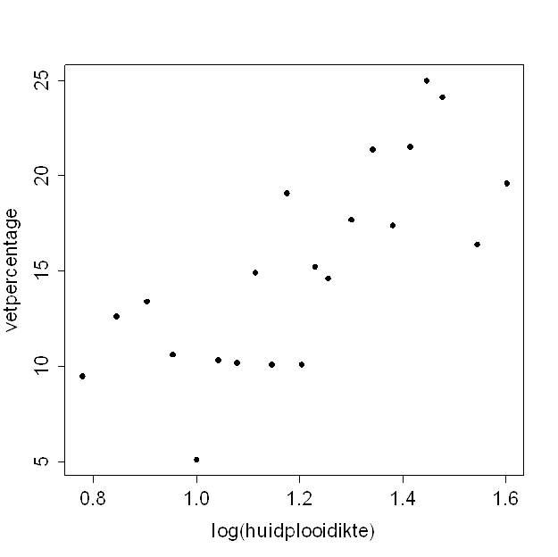

```{r, echo = FALSE, results = "hide"}
include_supplement("uva-correlation-1384-nl-graph01.png", recursive = TRUE)
```

Question
========

Fat percentage can be estimated using (the logarithm of) the sum of the skinfold thicknesses of biceps and triceps.______________________ Attached is a scatterplot plotting both of these variables against each other.Ê The correlation coefficient of fat percentage and log(skinfold thickness) in this sample is:



Answerlist
----------

* 0.35
* 0.75
* 0.92
* 17.2

Solution
========

Answerlist
----------

* 0.35: Incorrect
* 0.75: Correct
* 0.92: Incorrect
* 17.2: Incorrect

Meta-information
================
exname: uva-correlation-1384-en
extype: schoice
exsolution: 0100
exsection: Descriptive statistics/Summary Statistics/Bivariate statistics/Correlation
exextra[Type]: Calculation
exextra[Language]: English
exextra[Level]: Statistical Literacy
exextra[IRT-Difficulty]: 0
exextra[p-value]: 0.9242
