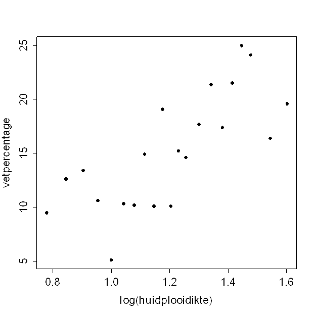

```{r, echo = FALSE, results = "hide"}
include_supplement("uva-correlation-1384-nl-graph01.png", recursive = TRUE)
```

Question
========

Vetpercentage kan geschat worden met behulp van (de logaritme van) de
som van de huidplooidiktes van biceps en triceps.\
Bijgaand is een spreidingsdiagram waarin deze beide variabelen tegen
elkaar staan uitgezet.\
De correlatiecoëfficiënt van vetpercentage en log(huidplooidikte) in
deze steekproef is:



Answerlist
----------

* 0.35
* 0.75
* 0.92
* 17.2

Solution
========

Answerlist
----------

* 0.35: Incorrect
* 0.75: Correct
* 0.92: Incorrect
* 17.2: Incorrect

Meta-information
================
exname: uva-correlation-1384-nl
extype: schoice
exsolution: 0100
exsection: Descriptive statistics/Summary Statistics/Bivariate statistics/Correlation
exextra[Type]: Calculation
exextra[Language]: Dutch
exextra[Level]: Statistical Literacy
exextra[IRT-Difficulty]: 0
exextra[p-value]: 0.9242
