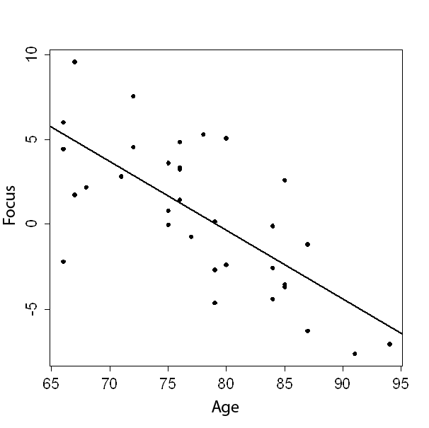

```{r, echo = FALSE, results = "hide"}
include_supplement("uva-correlation-1393-en-graph01.png", recursive = TRUE)
```

Question
========

One study examined the relationship between age and the ability to focus on something. Below is a scatterplot of the results, along with the corresponding regression line.______________________________. The correlation coefficient between age and ability to focus is approximately:



Answerlist
----------

* -0.91
* -0.70
* 0.56
* -0.32

Solution
========

Answerlist
----------

-0.91: Incorrect
-0.70: Correct
* 0.56: Incorrect
-0.32: Incorrect

Meta-information
================
exname: uva-correlation-1393-en
extype: schoice
exsolution: 0100
exsection: Descriptive statistics/Summary Statistics/Bivariate statistics/Correlation
exextra[Type]: Calculation
exextra[Language]: English
exextra[Level]: Statistical Literacy
exextra[IRT-Difficulty]: 0
exextra[p-value]: 0.9242
