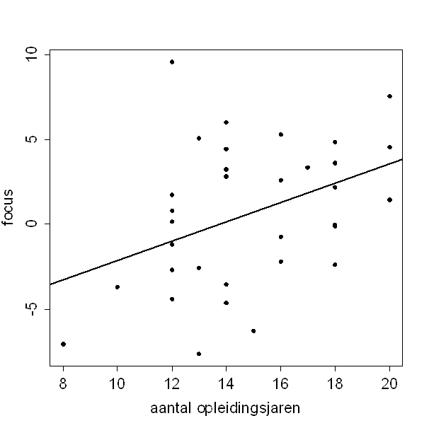

```{r, echo = FALSE, results = "hide"}
include_supplement("uva-correlation-1397-nl-graph01.png", recursive = TRUE)
```

Question
========

In een onderzoek is bij 33 ouderen gekeken naar het verband tussen
opleidingsniveau (aantal jaren school) en het vermogen om ergens op te
focussen. Hieronder staat een spreidingsdiagram van de resultaten, met
de bijbehorende regressielijn.\
De correlatiecoëfficiënt  tussen aantal jaren opleiding en vermogen om
te focussen is ongeveer:\



Answerlist
----------

* 0.40
* 0.57
* 0.83
* 0.92

Solution
========

Het correcte antwoord is: 

* 0.40

Meta-information
================
exname: uva-correlation-1397-nl
extype: schoice
exsolution: 1000
exsection: Descriptive statistics/Summary Statistics/Bivariate statistics/Correlation
exextra[Type]: Calculation
exextra[Language]: Dutch
exextra[Level]: Statistical Literacy
exextra[IRT-Difficulty]: 0
exextra[p-value]: 0.9242
