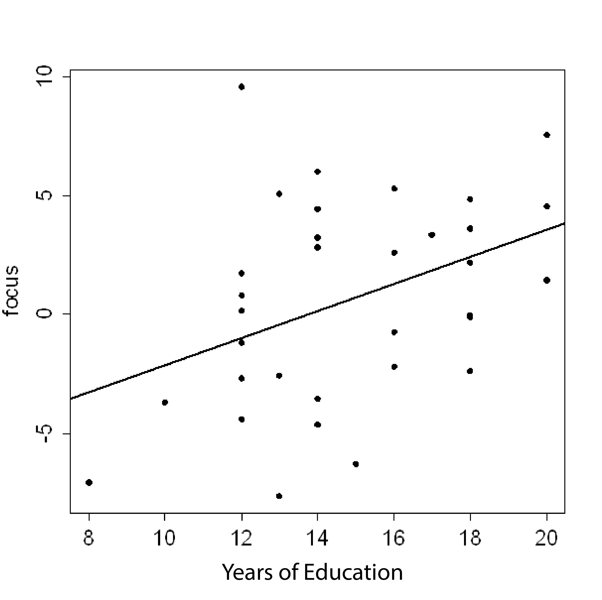

```{r, echo = FALSE, results = "hide"}
include_supplement("uva-correlation-1399-en-graph01.png", recursive = TRUE)
```

Question
========

One study looked at 33 elderly people to examine the relationship between education level (number of years in school) and the ability to focus on something focus. Below is a scatterplot of the results, with the corresponding regression line.Ê Suppose an additional person with 18 years of education is measured. For which value of focus for that person would the correlation coefficient increase the most increase?



Answerlist
----------

* -7.7
* 0
* 2.4
* 10.0

Solution
========

Answerlist
----------

* 7.7: Incorrect
* 0: Incorrect
* 2.4: Correct
* 10.0: Incorrect

Meta-information
================
exname: uva-correlation-1399-en
extype: schoice
exsolution: 0010
exsection: Descriptive statistics/Summary Statistics/Bivariate statistics/Correlation
exextra[Type]: Conceptual, Calculation
exextra[Language]: English
exextra[Level]: Statistical Literacy
exextra[IRT-Difficulty]: 0
exextra[p-value]: 0.9242
