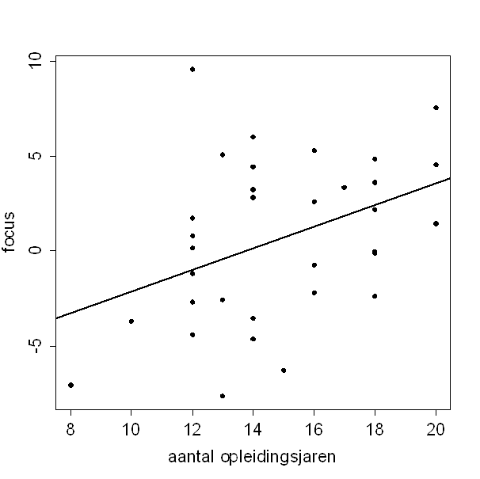

```{r, echo = FALSE, results = "hide"}
include_supplement("uva-correlation-1399-nl-graph01.png", recursive = TRUE)
```

Question
========

In een onderzoek is bij 33 ouderen gekeken naar het verband tussen
opleidingsniveau (aantal jaren school) en het vermogen om ergens op te
focussen. Hieronder staat een spreidingsdiagram van de resultaten, met
de bijbehorende regressielijn.\
Stel dat er een extra persoon met 18 jaren opleiding wordt gemeten. Voor
welke waarde van focus bij die persoon zou de correlatiecoëfficiënt het
meest toenemen?



Answerlist
----------

* -7.7
* 0
* 2.4
* 10.0

Solution
========

Answerlist
----------

* -7.7: Incorrect
* 0: Incorrect
* 2.4: Correct
* 10.0: Incorrect

Meta-information
================
exname: uva-correlation-1399-nl
extype: schoice
exsolution: 0010
exsection: Descriptive statistics/Summary Statistics/Bivariate statistics/Correlation
exextra[Type]: Conceptual, Calculation
exextra[Language]: Dutch
exextra[Level]: Statistical Literacy
exextra[IRT-Difficulty]: 0
exextra[p-value]: 0.9242
